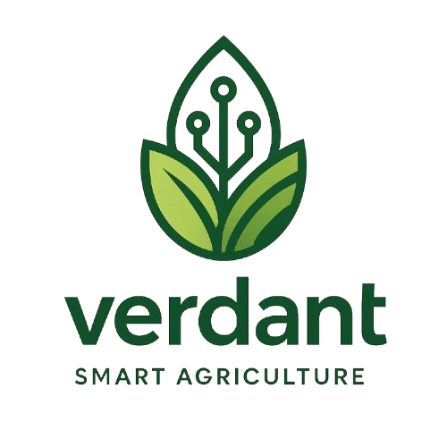
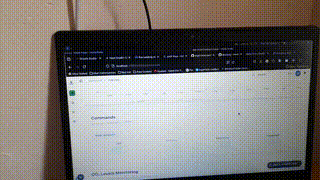

<p align="center">
  
</p>

# Verdant
Verdant is a vertical indoor farming system that combines IoT, cloud computing, and automation to 
optimize crop production in urban environments. It integrates real-time monitoring, smart 
decision-making, and remote control across multiple greenhouses and growing cells.

# Results
<details>
    <summary>Control Demo</summary>
    
</details>
<details>
    <summary>Monitoring Demo</summary>
    
</details>

# Features
- Autonomy: Each growing cell operates independently using an ESP8266 equipped with sensors for: 
 temperature, humidity, light, soil moisture, and CO₂; and actuators: water pumps, air pumps, heaters, 
and LED lighting which allows assuring optimal growing conditions for individual cells using 
threshold-based control logic.
- Dynamic device registration: MAC address-based ID registration for ESP8266 nodes simplifies 
deployment.
- Multi-Layer architecture: Cleanly separated into Physical, Edge, Gateway, and Cloud layers 
for modular design and extensibility.
- Centralized control: Next.js interface for live monitoring, manual overrides, and visual 
analytics, the front-end is supported by a NestJS backend, the whole application is deployed on 
Azure Kubernetes Service with Event Grid acting as the central MQTT message broker.

# System Architecture
```
        +-------------------------+
        |       Azure Cloud       |
        |-------------------------|
        | Nest.js APIs + DB (AKS) |
        | Event Grid Messaging    |
        +-------------------------+
                 ↑      ↓
        +-------------------------+
        | Raspberry Pi Gateway    |
        | Mosquitto Broker        |
        | Python Forwarder        |
        +-------------------------+
                 ↑      ↓
        +-------------------------+
        | ESP8266 Node            |
        | ↔ Arduino Uno           |
        | Sensors + Actuators     |
        +-------------------------+
```

# Technologies & Hardware
## Microcontrollers
- **ESP8266**: Wi-Fi node, actuator logic, ID assignment, local decision-making
- **Arduino Uno**: Sensor interfacing, analog data acquisition, UART to ESP

## Microprocessors
- **Raspberry Pi**: MQTT Broker + Python bridge to cloud

## Sensors
- **DHT22**: Temp/Humidity
- **LDR**: Ambient Light
- **Soil Moisture**: Irrigation threshold
- **MH-Z19B CO₂**: Ventilation control

## Actuators
- **Air Pump**: Ventilation/CO₂ dilution
- **Water Pump**: Irrigation system
- **LED Light**: Growth-phase lighting

## Software Stack
- **Backend**: [Nest.js](https://nestjs.com/), [PostgreSQL](https://www.postgresql.org/)
- **Frontend**: [Next.js](https://nextjs.org/), Charts & Live Data Display
- **Cloud**: [Azure AKS](https://azure.microsoft.com/en-us/services/kubernetes-service/), [Event Grid](https://learn.microsoft.com/en-us/azure/event-grid/)

# Validated Capabilities
- MAC-based ESP ID assignment & EEPROM persistence
- Real-time sensor readings and MQTT publication
- Actuator triggering based on thresholds
- Hourly consumption calculations (time × flow rate/power)
- Remote manual control through UI
- System resilience with offline fallback logic
- Centralized cloud analytics for multiple greenhouses

# Project Team
- **MERZOUKA Younes Abdel Samade**
- **TOUBAL SEGHIR Kheir Eddine**
- **MOULAY LAKHDAR Zakaria**
- **FENDI Mohammed**
- **HARRATH Bouchra**

> 🎓 Higher School of Computer Science Sidi Bel Abbès  
> 🧑‍🏫 Supervised by: **Pr. RAHMOUN Abdellatif**
